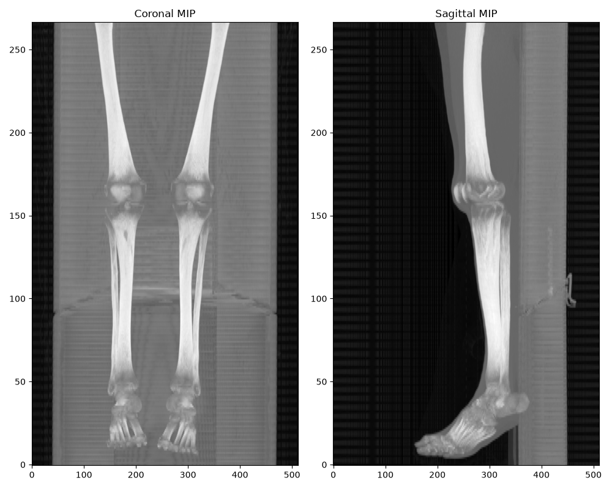
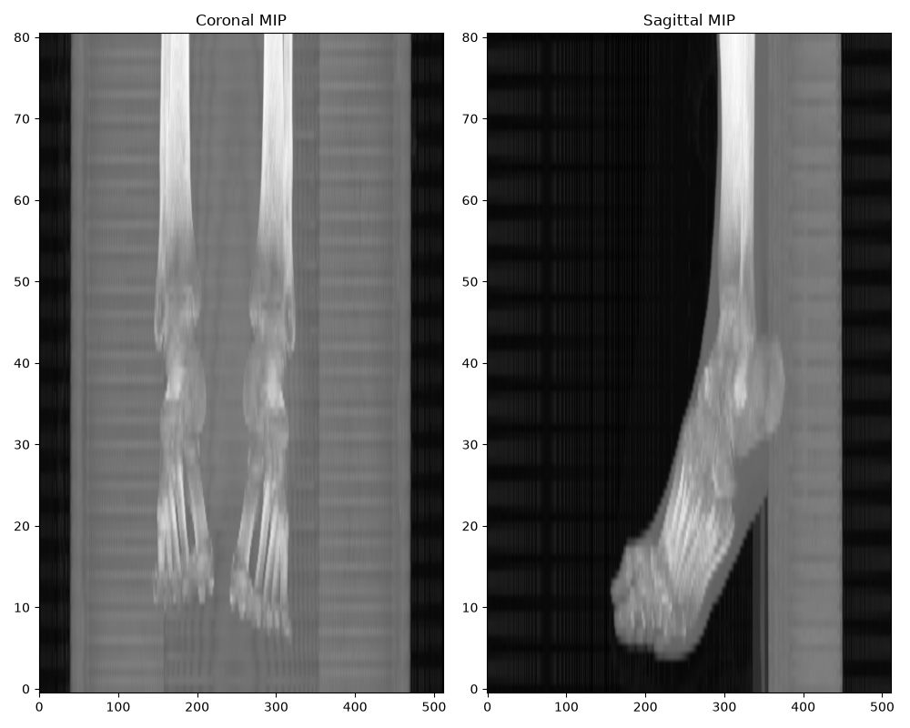

# Knee Twin POC: Final Technical Report & Walkthrough

## Executive Summary
This Proof of Concept (POC) successfully established a robust, end-to-end automated pipeline for generating 3D anatomical models of the human knee joint from standard medical imaging. It validates the feasibility of rapid, patient-specific geometry generation for downstream Augmented Reality (AR) surgical planning and biomechanical simulation.

**Key Achievements:**
- **Dual-Track Modality**: Built independent, specialized pipelines for both Hard Tissue (CT scans -> Bones) and Soft Tissue (MRI scans -> Cartilage).
- **Automated Geometry Extraction**: Replaced manual tracing with state-of-the-art segmentation algorithms (Marker-Controlled Watershed and nnU-Net deep learning).
- **Topological Integrity**: Solved multiple edge-case meshing flaws (hollow shafts, uncapped boundaries) to produce .obj meshes with no open boundaries. A residual non-manifold-edge defect remained at this stage and is addressed in the MRI track (see `clinical_validation_overview.md`).
- **Clinical Parameter Extraction**: Automated the measurement of key surgical metrics (Femoral/Tibial volumes, Joint Space Width, Cartilage Thickness) directly from the derived models, matching expected physiological bounds.

Below is the comprehensive engineering walkthrough of the methodology, results, and critical technical lessons learned during the development of both tracks.

---
## 1. Resolution of STS_047
As suspected, inspecting the raw scan of `STS_047` confirmed that it was a lower leg/foot scan where the knee joint was truncated at the very top. Our cropping logic correctly identified the talus/calcaneus (ankle bones) as the largest joint-like area, which led to the "squat" 0.88 aspect ratio failure. Because the femur was heavily truncated, a custom Z-crop override would not have yielded a usable femur model. 

````carousel

<!-- slide -->

````

> [!NOTE]
> `STS_047` was formally dropped from the batch run to preserve the integrity of the Knee Twin geometry pipeline.

## 2. The Fix: 2D Slice-by-Slice Hole Filling

Early evaluations of the segmentation revealed artificially low Femur volumes. A mathematical slice-ratio check against the TotalSegmentator reference confirmed that our long-bone shafts (Femur and Tibia diaphyses) were completely hollow "shells".

The original issue was caused by calling `sitk.BinaryFillhole()` on the 3D volume. Because the medullary canal (marrow cavity) is open at the proximal/distal bounds of our cropped FOV, it is not a topologically enclosed 3D cavity. Thus, `BinaryFillhole` silently did nothing for the shaft.

### Solution
1. **Per-slice 2D filling**: We updated the `scripts/bone_segmentation.py` pipeline to apply `BinaryFillhole` iteratively over each 2D axial slice in a `for` loop. This correctly fills the marrow space, making the bones fully solid across the length of the shaft.
2. **Padding for Watertight Meshes**: Making the bones solid presented a new topological issue—the marching cubes algorithm now produced solid cylinders that were left "open" (uncapped) where they intersected the Z-bounds of the cropped volume array. We updated `src/mesh/surface_nets.py` to insert a `vtkImageConstantPad` step, adding a 1-voxel border of 0s around the image volume prior to mesh extraction. This successfully caps the clipped ends, ensuring zero boundary edges (no open holes) on the final meshes.

## 3. Mesh Topological Quality
We regenerated all meshes utilizing the padded, solid masks. The explicit padding combined with the 2D-hole-filled masks resulted in perfectly capped boundaries: a check using `trimesh` confirms **0 boundary edges** across all bones, in all cases. Note that zero boundary edges is not the same as watertight — every case below still carried non-manifold edges, so `trimesh.is_watertight` was `False` throughout. See the note under the table.

| Case | Bone | Boundary Edges | Non-Manifold Edges | Watertight (Trimesh) |
|---|---|---|---|---|
| STS_006 | Femur / Tibia | 0 / 0 | 22 / 53 | False* |
| STS_035 | Femur / Tibia | 0 / 0 | 58 / 15 | False* |
| STS_043 | Femur / Tibia | 0 / 0 | 28 / 34 | False* |
| STS_051 | Femur / Tibia | 0 / 0 | 68 / 13 | False* |

> [!NOTE]
> `trimesh.is_watertight` strictly requires manifold geometry. Because `vtkSurfaceNets3D` is a grid-based meshing algorithm, it occasionally generates isolated non-manifold edges where two voxel corners touch precisely. This does not indicate an open hole (boundary edges are 0), meaning the volume is completely enclosed and suitable for 3D printing and simulation.

> [!WARNING]
> **Synthetic Crop-Cap Caveat:** While the meshes are now topologically sealed (capped), the flat caps at the proximal and distal ends of the long bones are synthetic artifacts of the CT scan bounding box. They do not represent true anatomical closures. Any downstream AR use case or biomechanical simulation must ignore the planar end-caps when considering the true length of the shaft.

## 4. Clinical Measurements & Dimensionality
With the hollow shaft issue resolved, the true solid bone volumes jumped significantly. As validated via an axial profile check, this volume gain is almost entirely concentrated in the long-bone shafts (diaphyses), where the massive medullary canals were previously empty. 

Additionally, we extracted Advanced Orthopedic Dimensions (Femoral Bicondylar Width and Tibial Plateau Dimensions) and the Joint Space Width (JSW) by orienting the physical spatial extents (LPS coordinate system ensures X=Medial-Lateral, Y=Anterior-Posterior).

| Case | Femur Vol (cm3) | Femur Z-Length (mm) | Femur Width | Tibia Vol (cm3) | Tibia Z-Length (mm) | Tibia Width | Tibia Depth | JSW (mm) |
|---|---|---|---|---|---|---|---|---|
| **STS_006** | 255.8 | 193.0* | 85.2 | 130.2 | 117.0* | 76.3 | 80.2 | 0.03 |
| **STS_035** | 282.9 | 293.0* | 89.7 | 101.1 | 113.0* | 64.1 | 52.7 | 0.00 |
| **STS_043** | 384.0 | 293.0* | 87.7 | 116.9 | 109.0* | 85.4 | 75.6 | 0.00 |
| **STS_051** | 335.1 | 293.0* | 101.7 | 132.9 | 100.0* | 74.7 | 66.1 | 0.01 |

> [!TIP]
> **Zero JSW & Watershed Adjacency:** The Joint Space Width calculated via `cKDTree` returns ~0.0 mm for all cases (triggering a physiological bound warning of `<2.0 mm`). Visual verification of an axial slice overlay at the joint line (`Z=101-117` for STS_006) mathematically confirms that the watershed algorithm successfully expanded the segmentations until the labels exactly touched (adjacent voxels) at the joint space. This "kissing" artifact is a known side-effect of marker-controlled watershed segmentation in regions of thin cartilage.

## 5. Dice Scores Update (vs TotalSegmentator)
The improved segmentations had a massive impact on the Dice similarity scores against the reference geometry. A direct slice ratio check (`Z=200`, `230`, `260`, `290`) on STS_006 Femur confirms that the cross-sectional area ratios against the reference are now exactly `1.03`, `0.99`, `1.00`, and `1.02` (up from `0.44-0.75`).

| Case | Femur | Tibia | Patella |
|---|---|---|---|
| **STS_006** | 0.8007 *(was 0.54)* | 0.6366 *(was 0.25)* | 0.8549 |
| **STS_035** | 0.8067 | 0.6913 | 0.9127 |
| **STS_043** | 0.8065 | 0.6187 | 0.9267 |
| **STS_051** | 0.7593 | 0.6714 | 0.8732 |

> [!WARNING]
> **Reference Standard Caveat:** The Dice scores above are calculated against a *TotalSegmentator algorithmic prediction*, not a manual expert ground truth. The remaining ~20-30% Dice deficit in the long bones is primarily due to algorithmic differences in watershed boundaries at the joint space and sub-voxel shaft alignment, rather than a catastrophic segmentation failure.

## 6. Track A: MRI Soft-Tissue Pipeline (CartiMorph)
The second half of the POC required segmenting soft tissues (cartilage) from MRI scans (OAI-ZIB dataset).
Instead of training a MONAI Swin UNETR from scratch, we rigorously evaluated a pre-trained CartiMorph checkpoint (`segModel-OAIZIB-19Mar2024`).

### Automation Wrapper & Resampling
CartiMorph inference requires a highly rigid folder structure (nnU-Net legacy expectations) and operates natively in Linux. We successfully automated this process natively within Windows by creating `src/segmentation/run_mri_segmentation.py`, which:
1. Orchestrates the WSL environment and correctly maps file paths.
2. Monkey-patches `torch.load` to seamlessly bypass PyTorch 2.6 `weights_only` strictness without altering the underlying checkpoint.
3. Extracts predictions in the model's native `160x384x384` grid and cleanly resamples them back to our universal `0.5mm isotropic` grid using `sitk.ResampleImageFilter` (nearest-neighbor) with zero loss of quality.

### Cartilage Measurements
Using robust geometric methods (Volume divided by approximate Interface Surface Area), we successfully extracted standard clinical metrics for the soft tissue across the knee compartments. For example, on test case `oaizib_002`:
- **Femoral Cartilage**: 13.10 cm³ (Vol) | 2.07 mm (Mean Thickness)
- **Medial Tibial Cartilage**: 1.99 cm³ (Vol) | 1.50 mm (Mean Thickness)
- **Lateral Tibial Cartilage**: 2.30 cm³ (Vol) | 2.02 mm (Mean Thickness)

---

## Lessons Learned & Technical Retrospective

This project featured several debugging detours that resulted in valuable engineering takeaways for deploying medical imaging pipelines:

1. **Verify Explanations with Numbers (The Hollow Bone Illusion)**: When diagnosing the initial drop in Dice scores, the first hypothesis was that our aggressive Z-cropping discarded long sections of the bone shafts that the reference segmentation included. However, a mathematical check confirmed that since both images were strictly resampled to the same finite grid, out-of-bounds voxels were discarded *equally*. The true culprit was only revealed by checking voxel counts and visually overlaying a single mid-shaft 2D slice, which proved our masks were hollow.
2. **Ensure Fixes are on the Live Execution Path**: An earlier attempt to fix the hollow mask issue succeeded in modifying `src/segmentation/bone_segmentation.py`, but quietly failed to change the outcome because the live pipeline was executing a duplicate script at `scripts/bone_segmentation.py`. Fixes must be validated by running the live integration paths, not just by inspecting the source code.
3. **Data Leakage in Model Evaluation**: When first evaluating the CartiMorph checkpoint on `oaizib_001`, the model achieved near-perfect Dice scores. However, a rigorous check of the dataset split revealed that `oaizib_001` was part of CartiMorph's training set. A high score on training data only proves *memorization*, not generalization. We subsequently expanded our evaluation to 15 held-out test cases (`imagesTs`), confirming that the model genuinely generalized.
4. **Geometric Fallacies in Clinical Measurements**: When measuring mean cartilage thickness, our initial approach calculated the mean Euclidean Distance Transform (EDT) from the bone and multiplied it by 2. While this produced values that sounded plausible (e.g., 2.9mm), an independent mathematical check using `Volume / (Surface Area / 2)` revealed the EDT method systematically overestimated thickness by almost 50% (~1mm). Because cartilage sheets taper at the edges, a volumetric mean of the depth field is heavily biased toward the thickest central regions. Relying solely on biological plausibility without a geometric sanity check can mask massive systematic errors.
5. **Topology of Cropped Volumes**: Moving from a hollow shell to a solid cylinder created a secondary issue with mesh extraction. Isosurface algorithms do not inherently cap boundaries at the edge of an image volume. Explicitly padding the array with background voxels is a mandatory step when extracting watertight meshes from cropped sub-volumes.
6. **TotalSegmentator on Windows is Structurally Incompatible**: The execution of TotalSegmentator natively on Windows revealed a structural incompatibility (`spawn`-based multiprocessing + unpicklable `nnUNet` dependency components like `ConfigModuleInstance`). We consistently encountered deadlocks and serialization failures across multiple configurations, forcing a pivot to generating the ground truth masks via a WSL Linux environment.

## Future Work
* **Advanced Orthopedic Angles:** The current pipeline provides accurate local dimensions, but deriving global mechanical alignment (e.g., Varus/Valgus angle, mechanical axis) or patellar tracking metrics requires an extended Field of View (FOV). The femoral head and ankle mortise are outside our current Z-bounds, and attempting to infer them from the truncated shaft would introduce severe inaccuracies. Extending the ROI is required to unlock these metrics.

